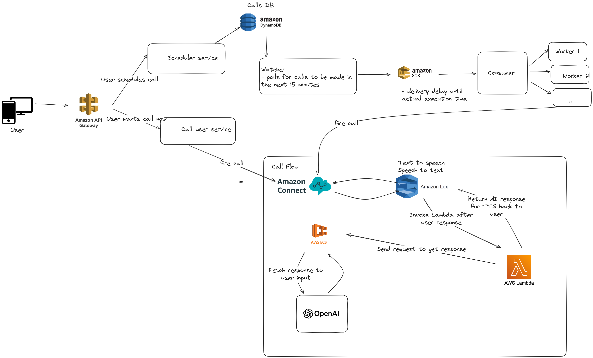

# Senti

**Senti** is an AI-powered mental health wellness wake-up platform that helps users start their day with compassion instead of a jarring alarm. Instead of ringing, Senti calls you with a supportive, empathetic AI voice designed to motivate you out of bed, especially on mornings when depression, anxiety, or burnout make it hardest to rise.  

---
# Demo URL 
[Click me!](https://www.loom.com/share/e59314451f364da39213e53a717699b7)
---

## Why Senti?
Mornings can feel impossible for millions of people living with depression and anxiety. While wellness apps focus on therapy or meditation, Senti addresses the **first step of the day: getting out of bed.**  

By combining empathy with technology, Senti helps users start their day feeling supported, not startled.  

## Features
- **AI Wake-Up Calls** – Replace alarms with personalized, empathetic conversations    
- **Web Scheduling Interface** – Simple interface for booking wake-up calls  
- **Low-Latency Infrastructure** – Sub-3 second response time during live calls **(will be improved)** 
- **Customizable Personalities** – Choose from motivational, gentle, or spiritual  

---

## Tech Stack
- **Backend:** Python, FastAPI  
- **Frontend:** React  
- **Telephony & AI:** AWS Connect, AWS Lex, AWS Lambda, OpenAI API  
- **Data & Caching:** AWS Elasticache (Valkey)  
- **Cloud Infrastructure:** AWS  

---

## Demo Architecture Overview
1. **User Scheduling (Web UI):** Users book wake-up calls via a React-based interface  
2. **Scheduling Engine:** FastAPI + Elasticache store call data and trigger logic  
3. **AI Call Flow:**  
   - AWS Connect initiates the call  
   - AWS Lex handles conversation (text-to-speech and speech-to-text)
   - Lambda integrates AI responses
4. **Response Delivery:** Users receive empathetic, natural voice conversations within seconds

---
## Fully Realized Architecture Overview

---

## Target Audience
- **Primary:** Gen Z & Millennials (18–34) struggling with mornings due to mental health challenges  
- **Secondary:** Caregivers scheduling calls for loved ones, universities, and HR wellness programs  

---

## Future Roadmap
- Decrease/mask 3 second response time
- Mobile app (iOS/Android)
- Utilizing RAG on official psychiatric help documents to craft responses
- Making voice sound more human  
- Enhanced personalization with mood tracking & AI adaptation   
- Corporate wellness integrations  

---

## License
MIT License  
